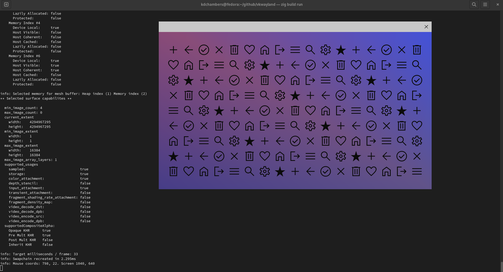

# vkwayland

*A reference application for vulkan and wayland.*

### Goals

- Easy to read and understand the code (Avoiding heavy abstractions or unrelated cruft)
- Make use of typical vulkan / wayland functionality
- Be performant and correct
- A common place to iron out best practices

I'm not an expert in vulkan or wayland, so audits are welcome.

Additionally, feature requests, questions and discussions are in scope for the project. Feel free to open an issue around a topic.

### Features

- Mostly self-contained within a ~3k loc source file
- Animated background (Color smoothly updates each frame)
- [Client-side](https://en.wikipedia.org/wiki/Client-side_decoration) window decorations for compositors that don't support drawing them on behalf of application (E.g Gnome / mutter)
- Updates cursor icon when application surface is entered
- Vulkan specfic wayland integration (Not using waylands shared memory buffer interface)
- Proper (mostly) querying of vulkan objects (Devices, memory, etc)
- Vulkan synchonization that doesn't rely on deviceWaitIdle (Except on shutdown)
- Dynamic viewport + scissor for more efficient swapchain recreation
- Image loading and texture sampling
- Surface transparency
- Window movement and resizing

## Requirements 

- Master build of [zig](https://github.com/ziglang/zig) (Tested with 0.11.0-dev.672)
- Wayland system (mutter, river, sway, etc)
- libwayland-client (Removal of dependency is a TODO)
- libwayland-cursor (Removal of dependency is a TODO)

## Running 

    git clone --recurse-submodules https://github.com/kdchambers/vkwayland
    cd vkwayland
    zig build run -Drelease-safe

**NOTE**: If you run the application in debug mode, you will get an error if vulkan validation layers aren't installed on your system.

## Credits

This application makes use of the following libraries and credits go to the authers and contributors for allowing this project to rely soley on zig code.

- [zigimg](https://github.com/zigimg/zigimg)
- [zig-vulkan](https://github.com/Snektron/vulkan-zig)
- [zig-wayland](https://github.com/ifreund/zig-wayland) 

## License

MIT