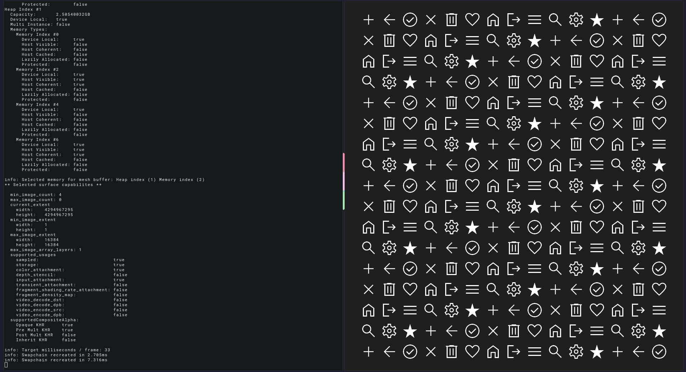

# vkwayland

*A reference application for vulkan and wayland.*

### Goals

- Easy to read and understand the code, without heavy abstractions
- Make use of most typical vulkan / wayland functionality
- Avoid unrelated complexity that detracts from the learning goal
- Be performant and correct
- A common place to iron out best practices

I'm not an expert in either vulkan or wayland, so audits are welcome as well as additional feature requests that show usage of a new aspect of either tech. 

Furthermore, questions and discussions are in scope for the project. Feel free to open an issue around a topic.

### Features

- Mostly self-contained within a ~3k loc source file
- Animated background (Color smoothly updates each frame)
- [Client-side](https://en.wikipedia.org/wiki/Client-side_decoration) decorations for compositors that don't support drawing window decorations on behalf of application (E.g Gnome / mutter)
- Updates cursor icon when application surface is entered
- Vulkan specfic wayland integration (Not using waylands shared memory buffer interface)
- Proper (mostly) querying of vulkan objects (Devices, memory, etc)
- Vulkan synchonization that doesn't rely on deviceWaitIdle (Except on shutdown)
- Dynamic viewport + scissor for more efficient swapchain recreation
- Image loading and texture sampling
- Surface transparency
- Window movement and resizing

### Roadmap

- [ ] Wayland: Toggle fullscreen
- [ ] Vulkan: Select a separate memory type for texture data (Currently reuses mesh memory type)
- [ ] Vulkan: TextureArray usage using push constants + multiple draw commands
- [ ] Vulkan: Update texture data during runtime

## Requirements 

- Master build of [zig](https://github.com/ziglang/zig).
- Wayland system (mutter, river, sway, etc)

## Running 

    git clone --recurse-submodules https://github.com/kdchambers/vkwayland
    cd vkwayland
    zig build run -Drelease-safe

## Credits

This application makes use of the following libraries and credits go to the authers and contributors for allowing this project to rely soley on zig code.

- [zigimg](https://github.com/zigimg/zigimg)
- [zig-vulkan](https://github.com/Snektron/vulkan-zig)
- [zig-wayland](https://github.com/ifreund/zig-wayland) 

## License

MIT